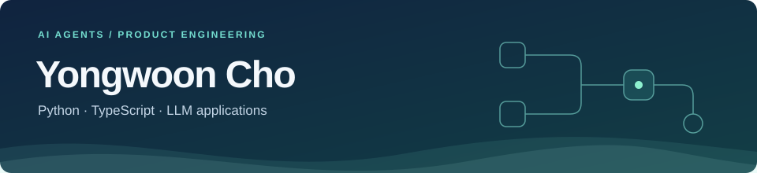

## 안녕하세요, 조용운입니다

LLM과 AI 에이전트 기능을 개발합니다. 도구 실행이 실패했을 때 원인을 찾고 다시 실행하는 흐름, 스트리밍 응답과 대화 기록이 화면에 제대로 전달되는 과정을 다뤄 왔습니다.

React·TypeScript로 사용자 화면을 만들면서, 기능에 필요한 Python API 서버와 비동기 워커까지 작업 범위를 넓혔습니다.

## 최근 다룬 문제

| 영역 | 작업 내용 |
| --- | --- |
| 에이전트 실패 복구 | 오류 정보를 저장하고, 복구 후보와 재실행 시작점을 제공하는 도구를 구현했습니다. 자동 복구 제외 대상을 구분하고 재시도·중단 지침을 정리했습니다. |
| 도구 호출과 대화 기록 | 병렬 호출 이후 대화가 실패하거나 새로고침하면 답변 순서가 달라지는 문제를 수정했습니다. 기록 저장·복원과 화면 처리를 함께 확인했습니다. |
| 모델 연동 | 생성은 되지만 수정은 실패하는 호출 경로를 추적했습니다. 모델별 응답 형식 차이로 답변이 표시되지 않는 문제도 수정했습니다. |

문제를 조사할 때는 정상 경로와 실패 경로를 비교합니다. 수정한 부분은 재현 사례와 테스트로 확인하고, 검증하지 못한 범위는 따로 기록합니다.

## 사용하는 기술

서버 · 실행 처리

에이전트 · LLM 연동

도구 호출, 스트리밍 응답, 대화 기록 처리

프론트엔드

알고리즘 기록

